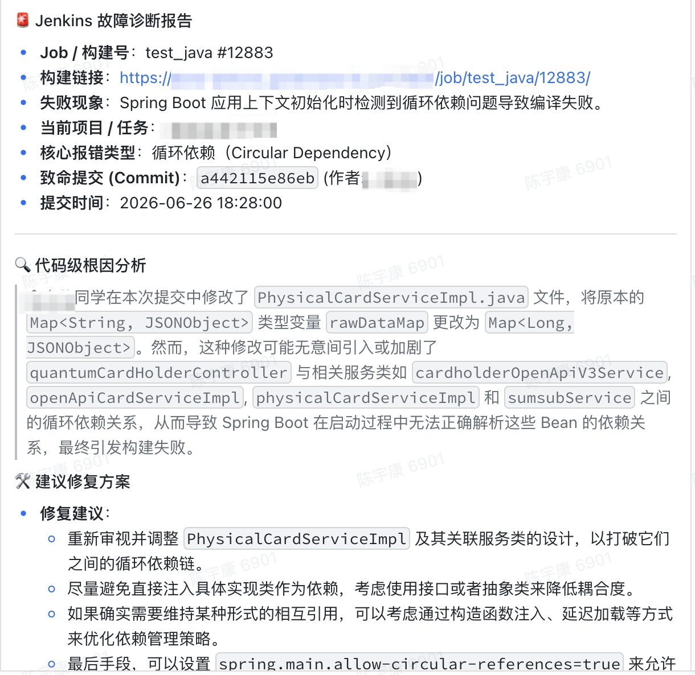

# Lark Agent Bot

Assist development and operations personnel in identifying and troubleshooting CI/CD and code build issues.

## Background

As business operations expand, code repositories grow in size, and the complexity of code builds increases. Development and operations staff must spend a significant amount of time diagnosing and resolving code build issues.

lark-agent-bot provides an efficient way to troubleshoot CI/CD issues.

## Get-started

### Prerequisites

- Python 3.10+
- Lark Bot App ID [Quickly develop a bot](https://github.com/larksuite/lark-samples.git)
- Lark Bot App Secret [Quickly develop a bot](https://github.com/larksuite/lark-samples.git)
- Lark Card ID [Card Kit](https://open.feishu.cn/cardkit?from=open_docs_header)

### Run bootstrap script

```bash
./bootstrap.sh
```

## Talk to the bot

Troubleshoot CI/CD issues through natural language conversations with a Lark bot.



## 许可

- Apache 2.0
