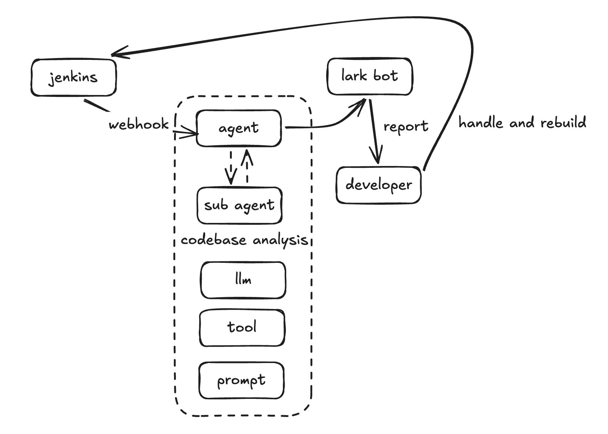
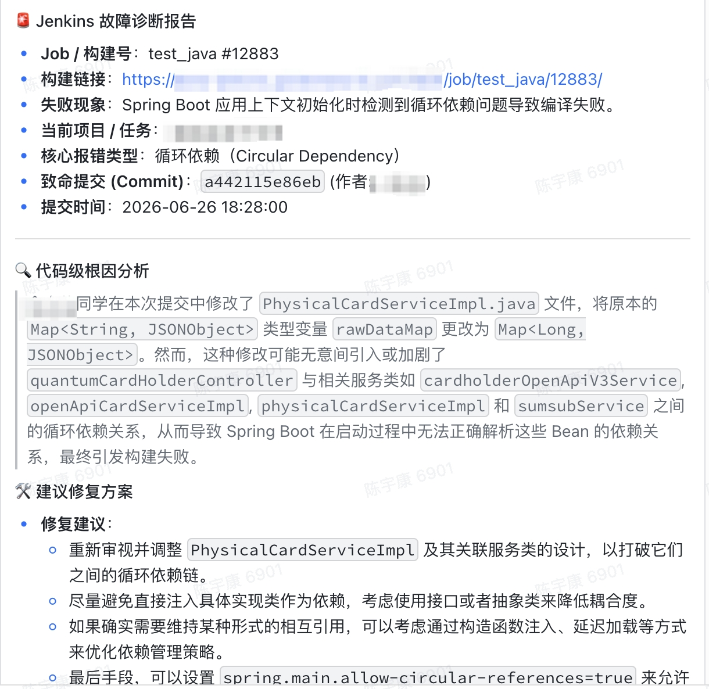

# Lark Agent Bot

Assist development and operations personnel in identifying and troubleshooting CI/CD and code build issues.

## Background

As business operations expand, code repositories grow in size, and the complexity of code builds increases. Development and operations staff must spend a significant amount of time diagnosing and resolving code build issues.

lark-agent-bot provides an efficient way to troubleshoot CI/CD issues.

## Architecture



The system connects Jenkins build events with agent-assisted codebase analysis and Lark notifications:

1. **Jenkins webhook**: Jenkins sends build events to the webhook service to start troubleshooting.
2. **Agent analysis**: The agent coordinates the investigation and delegates codebase analysis to a sub-agent. LLMs, tools, and task-specific prompts help examine build logs and relevant code changes to identify likely causes and suggest fixes.
3. **Lark report**: The analysis results are delivered through the Lark bot so developers can review the findings in their chat workflow.
4. **Developer feedback loop**: Developers review the report, address the issue, and trigger a new Jenkins build to verify the fix.

## Project layout

Application code lives in `app/`: `webhook/` and `lark/` handle incoming events,
`services/` orchestrates workflows, `agents/` contains model logic and tool adapters,
`integrations/` wraps Git and Jenkins, and `parsers/` handles log parsing.
See [directory responsibilities and Git usage](docs/project-structure.md).

Run tests with `uv run python -m unittest discover -s tests`.

## Get-started

### Prerequisites

- Python 3.14+
- Lark Bot App ID [Quickly develop a bot](https://github.com/larksuite/lark-samples.git)
- Lark Bot App Secret [Quickly develop a bot](https://github.com/larksuite/lark-samples.git)
- Lark Card ID [Card Kit](https://open.feishu.cn/cardkit?from=open_docs_header)

### Run bootstrap script

```bash
./bootstrap.sh
```

## Talk to the bot

Troubleshoot CI/CD issues through natural language conversations with a Lark bot.



## 许可

- Apache 2.0
